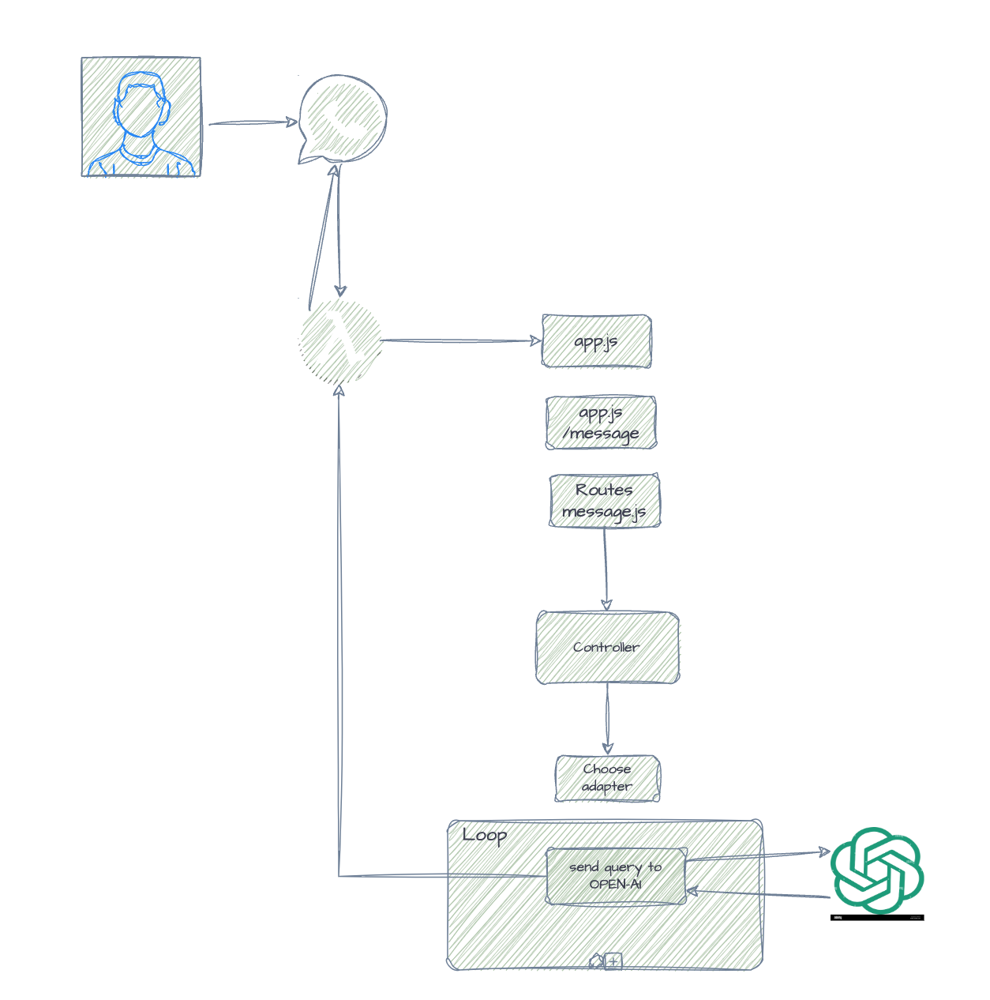

# ModularCode: Express Application with AWS Lambda and AWS SAM

ChatGPTExpress is an open-source project that integrates an Express.js application with AWS Lambda, leveraging MySQL as the primary database and Redis for storing user contexts. With ChatGPT providing intelligent input and output processing and seamless integration with WhatsApp via Twilio.

This project enables robust and scalable chatbot solutions. Perfect for developers looking to deploy serverless applications with advanced AI-driven chat capabilities and efficient context management.

# Forked From

## Forked From

This project is a fork of [ChatGPTLambdaExpress](https://github.com/bytebard-1151/ChatGPTLambdaExpress), which serves as the base for our enhancements and customizations.

# Flow



## Prerequisites

- Node.js and npm
- AWS CLI
- AWS SAM CLI
- Docker (for local development)

## Setup

1. **Install Dependencies:**

   ```bash
   cd src
   npm install
   ```

2. **Configure Environment Variables:**

   Create an `env.json` file in the root directory with the following content:

   ```json
   {
     "TWILIO_ACCOUNT_SID": "your_twilio_sandbox_account_sid",
     "TWILIO_AUTH_TOKEN": "your_twilio_sandbox_auth_token",
     "OPENAI_API_KEY": "your_openai_api_key"
   }
   ```

## Running Locally

1. **Run SAM CLI Locally:**

   For Unix-based systems (Linux, macOS):

   ```bash
   sam local start-api --env-vars env.json
   ```

## Debugging

1. **Configure VS Code for Debugging: [Broken at the moment]**

   Create or update the `launch.json` file in the `.vscode` directory with the following content:

   ```json
   {
     "version": "0.2.0",
     "configurations": [
       {
         "reason": "Its broken at the moment"
       }
     ]
   }
   ```

2. **Add a Debugging Script in `package.json` [Broken at the moment]**

   Ensure the debugging script in `package.json` is also updated to use the new port.

   ```json
   {
     "scripts": {
       "debug": "sam local invoke ExpressApi --template template.yaml --env-vars env.json --debug-port 9229"
     }
   }
   ```

3. **Start the Debugger [Broken at the moment]**

   - Open VS Code.
   - Go to the Run and Debug view by clicking the play icon on the sidebar or pressing `Ctrl+Shift+D`.
   - Select "SAM CLI Debug: Node.js" from the dropdown menu.
   - Click the green play button or press `F5` to start debugging.

4. **Verify No Conflicting Processes**

   Make sure no other process is using the port `9229`:

   For Unix-based systems (Linux, macOS):

   ```bash
   lsof -i :9229
   ```

   If you find a conflicting process, you can terminate it to free up the port.

## Testing

Run tests using Mocha (ensure Mocha is installed as a dev dependency):

```bash
npm test
```

## Deployment

**Deploy the SAM Application:**

```bash
sam deploy --guided
```

Follow the prompts to complete the deployment setup.
